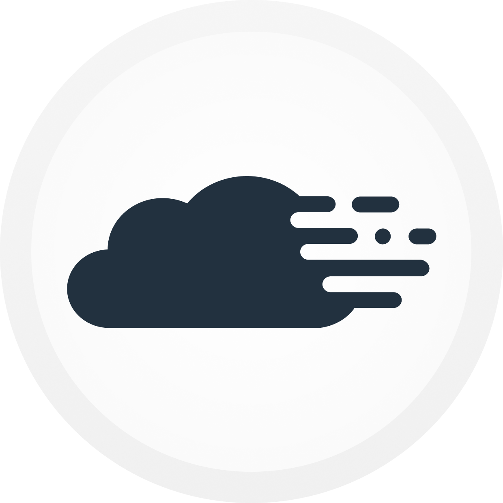
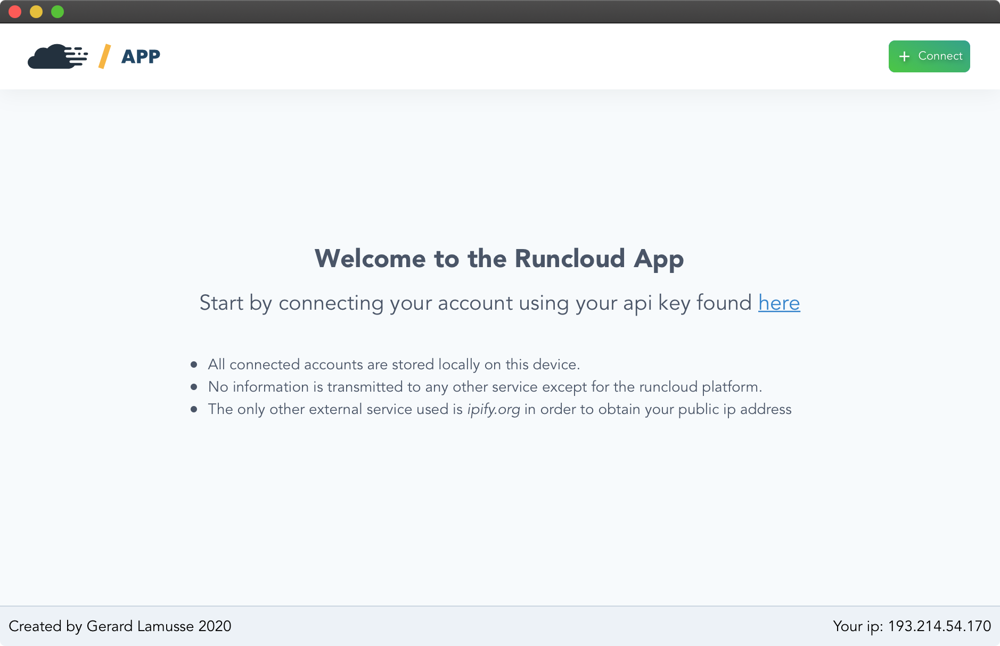
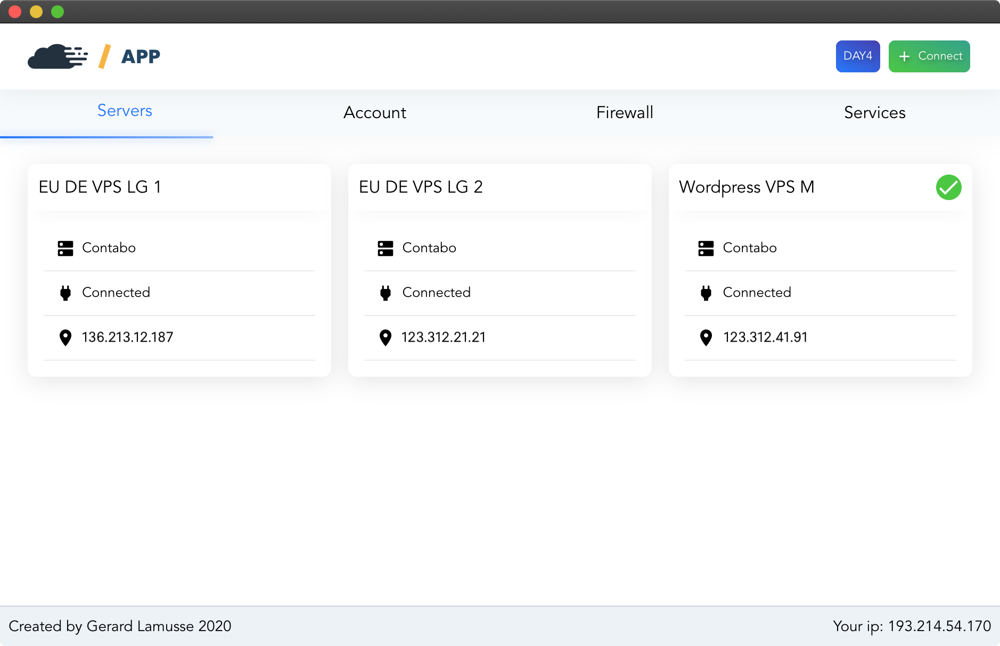
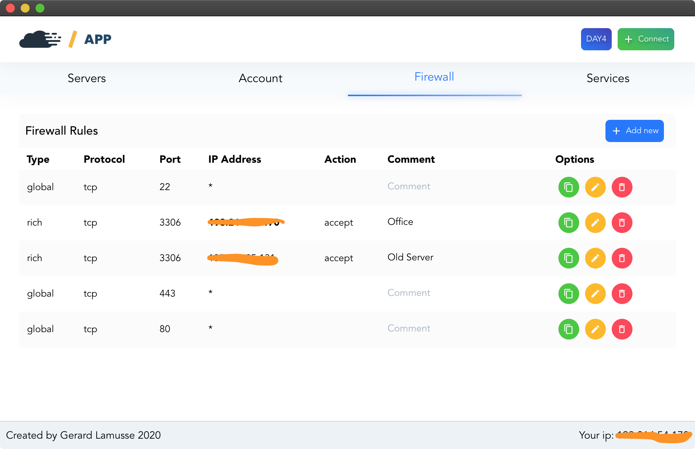
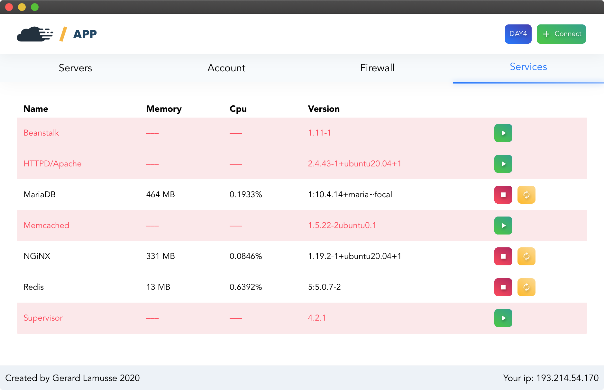

<p align="center">
  <a href="https://runcloud.io">
    
  </a>
</p>
<p align="center">
  <large>Runcloud Desktop App v0.1.1</large>
</p>

OSX Desktop app for specifically managing Runcloud server's firewall and services.

*[Download latest runcloudapp.dmg](https://github.com/u12206050/runcloud-desktop-app/releases/download/0.1.1/runcloudapp_0.1.1_x64.dmg)*

## Features

 - Add comments for each firewall rule
 - Shows your current IP address as a help for adding new firewall rules
 - Very light weight and open source

## Screenshots

<p align="center">
  
  
  
  
</p>

# Development

Don't forget to :star: the package if you like it. :pray:
PRs are very welcome.

## Project setup
```
npm install
```

### Compiles and hot-reloads for development
```
npm run serve
```

### Compiles and minifies for production
```
npm run build
```


# Disclaimer

Although I honestly believe I code to the best of my abilities, I am fully aware that problems may arise. I however cannot and do not take any responsibility for any damage this app may (but hopefully does not) cause.

Simply made with love and coffee